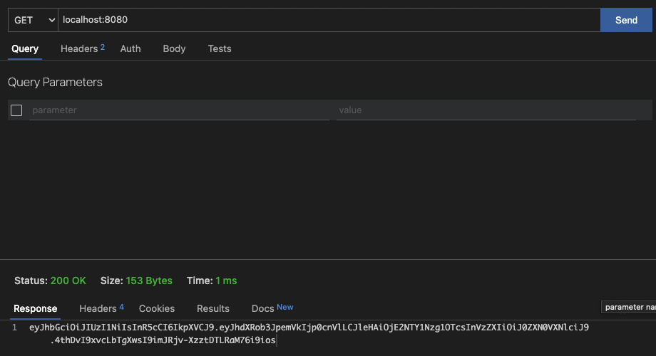
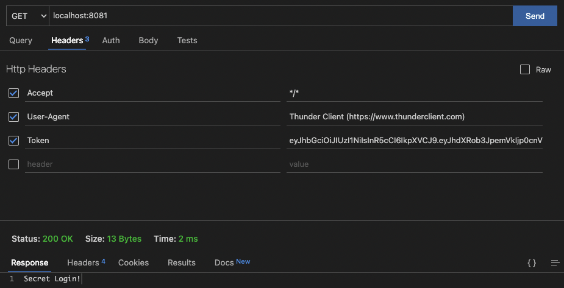

# Golang-JWT-Sample

### Starting (M1-ARM64)

```
go mod tidy
```

```
Server Starting

cd ./server
go run main.go

```

```
Client Starting
cd ./client
go run main.go


```


```
Create Token

GET 
localhost:8080
```
#
<p>
    

</p>

#

```

Login

localhost:8081

```

#

<p>
    

</p>


####    Thank You TutorialEdge